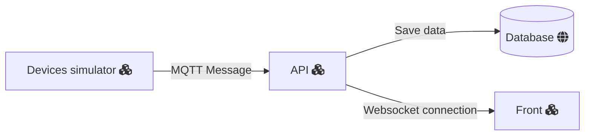

# Install

Run the yarn command to install the package.json depedencies

`yarn`

You can run a mongodb docker container using the docker-compose in case of not having mongodb installed

`docker-compose up`

This will only work if you have docker installed
You can import the data from database to execute tests using the [devices.json]('./dbExport/devices.json').

The API runs after executing the start command

`yarn run start`

This has no endpoint but provide a MQTT listen and a WS server that are up to receive messages and send it to aplications connected.

# MQTT

The aplication uses the test mqtt broker from mosquitto

`mqtt://test.mosquitto.org`

you can change it to a local broker or any other by defining it on a .env file with the name DEV_MQTT_URL

# Overview

The aplication's three parts; Server, Front and Devices Simulator

# Tests
This project contains several Jest test scripts that test the functionality of a system or software. Below are explanations of each of the test scripts:

* test-cases: This script runs all of the test cases located in the ./tests/cases/ directory.
* test-create: This script tests the create functionality of the system by running the test cases located in the ./tests/cases/create.spec.ts file.
* test-read: This script tests the read functionality of the system by running the test cases located in the ./tests/cases/read.spec.ts file.
* test-delete: This script tests the delete functionality of the system by running the test cases located in the ./tests/cases/delete.spec.ts file.
* test-update: This script tests the update functionality of the system by running the test cases located in the ./tests/cases/update.spec.ts file.
* test-database: This script tests the database functionality of the system by running the test cases located in the ./tests/database directory.
* test-integration: This script tests the integration functionality of the system by running the test cases located in the ./tests/integration directory.

To run any of the scripts, you can type yarn run <script-name> in the command line. For example, to run the test-create script, you can type npm run test-create. This will execute all the test cases in the create.spec.ts file and provide feedback on the results.