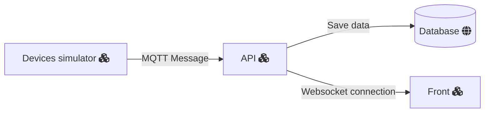

# Install

Run the yarn command to install the package.json depedencies

`yarn`

Then you must create a .env file following the env.example file.
In the [front](front/index.html) the wsl url gotta be replaced by ws://localhost:<the port setted to ws on .env> 

You can run a mongodb docker container using the docker-compose in case of not having mongodb installed

`docker-compose up`

This will only work if you have docker installed
You can import the data from database to execute tests using the [devices.json](dbExport/devices.json).

The API runs after executing the start command

`yarn run start`

This has no endpoint but provide a MQTT listen and a WS server that are up to receive messages and send it to aplications connected.

# MQTT

The aplication uses the test mqtt broker from mosquitto

`mqtt://test.mosquitto.org`

you can change it to a local broker or any other by defining it on a .env file with the name DEV_MQTT_URL

# Overview

The aplication's three parts; Server, Front and Devices Simulator

The MQTT message has a payload and an action. The action must describe the service and the payload the necessary data.

Example:
`
{
    action : 'create,
    payload:{
        device:{
            name,
            deviceData
        }
    }
}
`
Sending this using mqtt a device gonna be created.

# Simulator

The simulator consists in scripts that send mqtt messages. It's got three function

createDevice()
updateDevice()
excludeDevice()

They will costantly send messages using data hardcoded.

## createDevice

Use a devices array to make new registers

## updateDevice 

Gonna use a list of id's to send update messages

## excludeDevice

Send delete commands using id's stored on an array

# API

The aplication core gets messages from mqtt and execute actions based on it

| **Action** | **Payload** | **Response** | **Description** |
| --- | --- | --- | --- |
| create | {"Device": {...}} | {"Device": {...}} | Creates a new device object with the specified parameters and returns the created device object. The "Device" object in the payload must contain all the necessary parameters required for device creation. |
| update | {"Device": {...}, "id": "..."} | {"Device": {...}} | Updates the device object with the specified ID and returns the updated device object. The "Device" object in the payload must contain all the necessary parameters required for device update, and the "id" field must specify the ID of the device to be updated. |
| delete | {"id": "..."} | {"Device": {...}} | Deletes the device object with the specified ID and returns the deleted device object. The "id" field in the payload must specify the ID of the device to be deleted. |

It's use a implementation of MQTTjs to consume the mqtt broker, Mongoose as ORM and WS as websocket provider

In a little overview, the depedencies implementations follows abstractions and use adapters to work properly with most inner layers. The communications is based on DTOs and use Either Pattern as error handler.

In some cases Factory Pattern is used instead of class. This helps to avoid bugs that contexts changes causes on class objects.

# Front

The front is a pretty basic html page that connects to the websocket server started by the core. On connection the socket immediatly receive all devices stored on the database and displays it. The front uses WS to get updates in real time.

# Running it

> **_NOTE_** Important remember that the server is restarted with the front running, the front must be refreshed in order to get a new socket connection

You firstly must run the aplication core with the command start

`yarn run start`

Run the simulator to see the comunication between it and the core.
It's possible to comment a simulation function call to stop the simulation, commenting the excludeDevice() will stop exclusion of devices for example. By default only the updateDevice() is not commented.

`yarn run simulator`

Then you can open the [front](front) in your browser. If the core has connected to the database and it's the imported device data it gonna display the devices by now.

# Tests
This project contains several Jest test scripts that test the functionality of a system or software. Below are explanations of each of the test scripts:

* test-cases: This script runs all of the test cases located in the ./tests/cases/ directory.
* test-create: This script tests the create functionality of the system by running the test cases located in the ./tests/cases/create.spec.ts file.
* test-read: This script tests the read functionality of the system by running the test cases located in the ./tests/cases/read.spec.ts file.
* test-delete: This script tests the delete functionality of the system by running the test cases located in the ./tests/cases/delete.spec.ts file.
* test-update: This script tests the update functionality of the system by running the test cases located in the ./tests/cases/update.spec.ts file.
* test-database: This script tests the database functionality of the system by running the test cases located in the ./tests/database directory.
* test-integration: This script tests the integration functionality of the system by running the test cases located in the ./tests/integration directory.

To run any of the scripts, you can type yarn run <script-name> in the command line. For example, to run the test-create script, you can type npm run test-create. This will execute all the test cases in the create.spec.ts file and provide feedback on the results.